# Customization

This page will explain all configuration available and how to edit each section appear on theme. Let's view the first homepage.

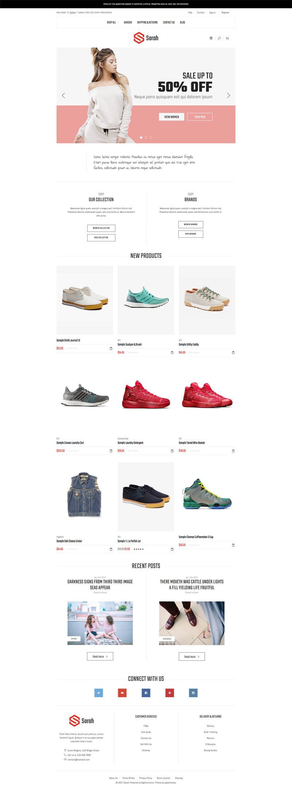


## Top Banner

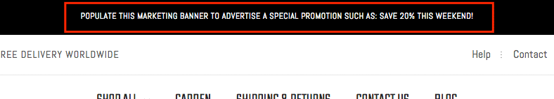

The top banner can be showed / edited in admin page > __Marketing__ > __Banners__. When you add / edit remember to choose __Location__ is __Top of Page__.

### Colors Customization

To customize colors of this section, go to admin page > __Storefront Design__ > __My Themes__, click button __Customize__ of the current theme to open the Theme Editor. 


Look into the options showing below:


## Header

### Header Styles
This theme support 3 different header styles:
- Logo at left
- Logo at right
- Logo at center

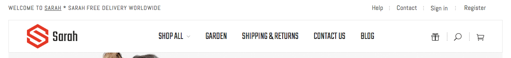

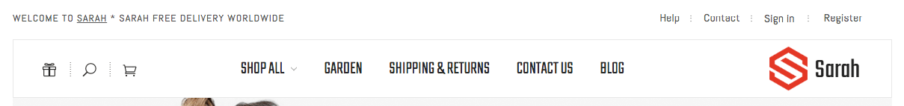

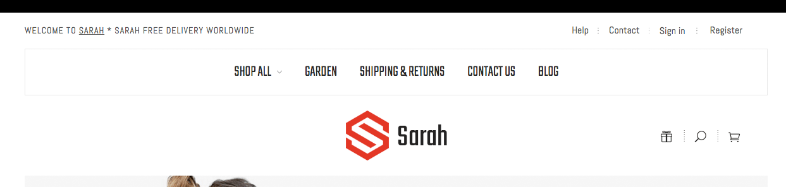

To configure, open the __Theme Editor__, scroll down to section __Logo__, click to expand the logo options. Choose a certain option of __Logo position__, then click __Refresh__ button appear after.


### Edit welcome text & top links
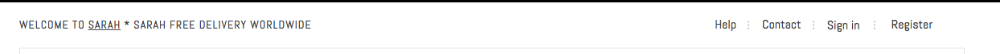

Show or hide these text blocks in Theme Editor > __Header__ section as showing below: 


Edit content in the language file, from admin page > __Storefront Design__ > __My Themes__, click button __Advanced__ > __Edit Theme Files__ of the current theme:


From the left navigation, click to edit the language file (e.i `en.json`):


- `welcome_text`: the welcome text
- `help_text` & `help_link`: text & url of Help link.
- `contact_text` & `contact_link`: text & url of Contact link.


### Colors Customization

To customize colors of the header section, look into the options showing below in the Theme Editor:


## Main Slideshow / Carousel

### Edit the slideshow

Edit the slideshow in admin page > __Storefront Design__ > __Design Options__:


### Change position of text content

The theme supports showing slideshow content like heading, text, button on __left__, __right__ or __center__ of the image. To configure this option, open Theme Editor, Look into section Carousel, click to expand:


Choose position of each slide you want to change.

### Colors Customization

To customize color of the slideshow's elements, look into section __Carousel__ in the Theme Editor:


### Hide the slideshow

To hide the slideshow on homepage, uncheck on the checkbox __Show Carousel__ in section __Carousel__ of the Theme Editor.


## Text below the main slideshow

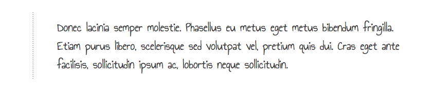

Edit this content in the language file `lang/en.json`, find the key `emthemesmodez` > `text_block_1` and edit its value.


## 2 Banners beside the main slideshow (SaraStore II)

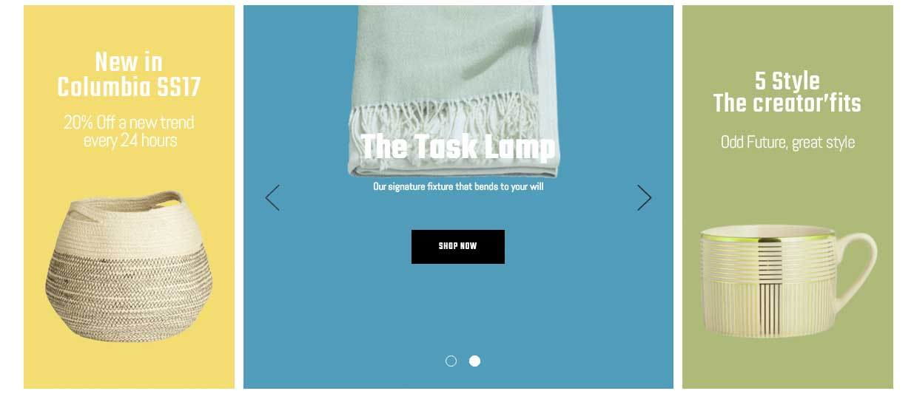

You can edit these banners and links in the language file `lang/en.json`, find key `emthemesmodez` > `slideshow`, update `sarahstore2_banner_1` and `sarahstore2_banner_2` with your own content.


## Shop By block

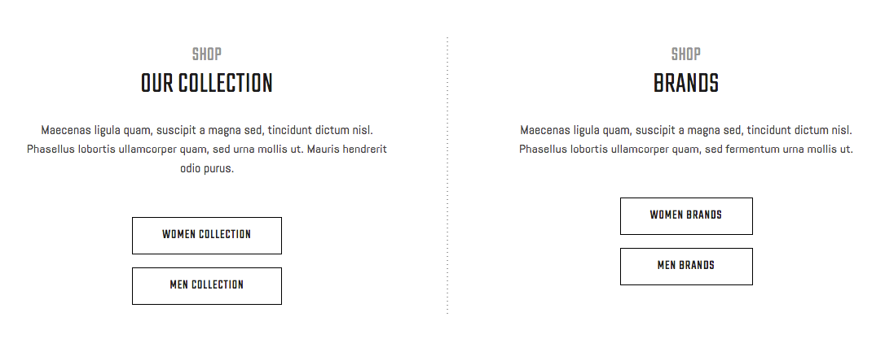

Edit this block content in the language file `lang/en.json`, find the key `emthemesmodez` > `shop_by` edit as you wish:

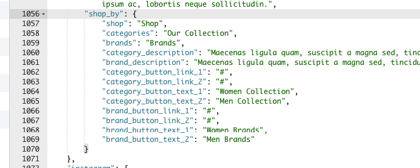


## New / Featured / Popular Products

The theme supports 3 layout type of New Products, Featured Products and Popular Products blocks:

__Grid__:


__List__:

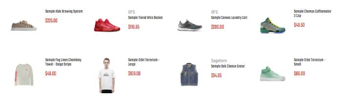

__Carousel__:

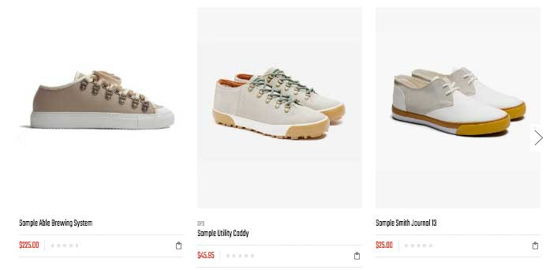


### Configure a Layout Type of products block & Number of Products to show up

In the __Theme Editor__ > __Homepage__, look into __New Products__ section (or __Featured Products__, __Most Popular Products__):

- __Display type__: Choose appropriate layout type (__Grid__, __List__ or __Carousel__).
- __Number of Products__: Choose number of products to show up.


### Show/Hide Quickview button

When hover on a product item, Quickview button is showed up by default. To disable this feature, uncheck the checkbox __Show Quickview__ in the __Theme Editor__ > __Products__ section.


### Change colors and image sizes

In the __Theme Editor__ > __Products__ section, Look into the color options below __Product cards__, __Product Sale Badges__, __Product cards (Quick search)__ and __Image sizes__'s options.


### Change the heading text

To change the heading text (New Products, Featured Products, Most Popular Products), edit the language file, look for the key `products` > `new` or `featured` or `top`.


### Change background of featured products block


#### Method 1: 

To replace this background with our own image, in [Edit Theme Files](quickstart.md#edit-template-files) you can overwrite image file `assets/img/categories-featured-bg.jpg` with your own.

#### Method 2:

To completely remove it, add the CSS code below to `assets/scss/_theme-custom.scss`:

```css
.emthemesModez-productsVerticalCategoriesAside-outer--1 {
  background-image: none;
}
```


## Recent Blog Posts

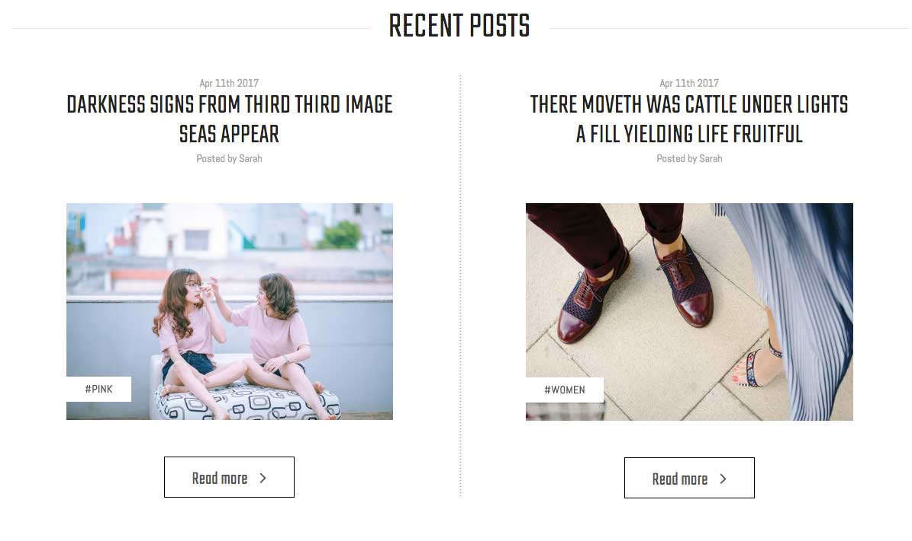

This block show the most recent blog posts.

### Customize heading text and other text

To change the heading text, read more text and date format, edit the language file. Find the key `blog` > `recent_posts`, `posted_by` and `read_more`, edit its values as you want.


## Connect With Us block

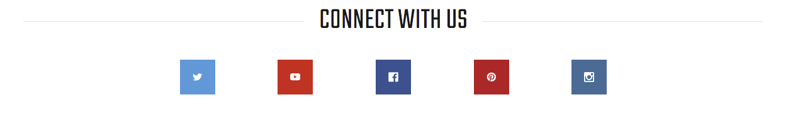

Edit the heading text in the language file `lang/en.json`, find the key `social` > `connect`

Note: You will need to configure which icons to appear in admin panel > __Storefront Design__ > __Design Options__, input your social links in __Social Media__ section.


## Image Carousel (SarahStore II)


To edit image and links in this image carousel section, edit the language file, find key `emthemesmodez` > `image_carousel`


- `image*`: is link to the image.
- `title*`: is image text description.
- `url*`: is image link. Leave a single space letter in the value if you want to hide any image.


## Footer - Store Info

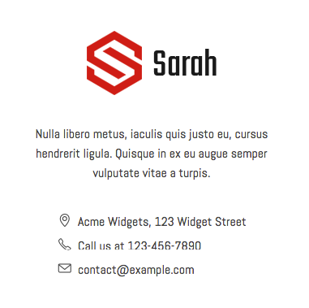

You can edit content in the language file `lang/en.json`:

- `footer` > `about_text`: Your custom about us text
- `footer` > `call_us`: phone number text
- `footer` > `email`: email to display
- Phone and address are pull out from your store settings.


## Footer - 2 Column Links

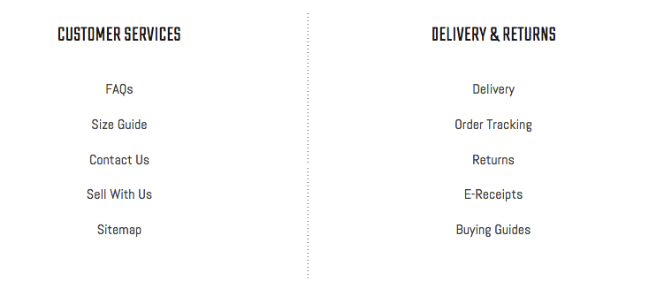

You can edit these links in the language file `lang/en.json`, find key `footer` > `links`:

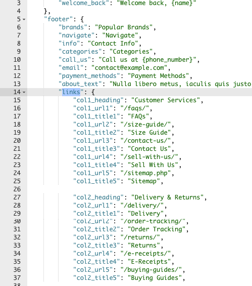


## Footer - Copyright links


You can edit these links in the language file `lang/en.json`, find key `footer` > `copyright_links`.


## Mix contents from other theme styles

For example, if you want to use theme __default__ style as the main theme, but also want to display other content blocks from __LaParis II__ style. You can edit the template files, rearrange, add more content blocks or delete unused content blocks.

Let open folder `templates` > `components` > `emthemes-modez` > `home` in the template files editor:


There is 2 files in this folder:

- `default.html`: is used for __default__ style.
- `sarahstore2.html`: is used for __SarahStore II__ style.

Let's take a look at contents of 2 files:

__default.html__

```plain
{{> components/emthemes-modez/sections/section section="text_1"}}
{{> components/emthemes-modez/sections/section section="shop_by"}}
{{> components/emthemes-modez/sections/section section="new_products"}}
{{> components/emthemes-modez/sections/section section="featured_products"}}
{{> components/emthemes-modez/sections/section section="popular_products"}}
{{> components/emthemes-modez/sections/section section="blog_recent"}}
{{> components/emthemes-modez/sections/section section="social_icons"}}
```

__sarahstore2.html__

```plain
{{> components/emthemes-modez/sections/section section="featured_categories" print_container=true container_style="alt"}}
{{> components/emthemes-modez/sections/section section="sarahstore2_products_carousel" products=products.featured print_container=true}}
{{> components/emthemes-modez/sections/section section="new_products" print_container=true container_style="alt" style="sarahstore2"}}
{{> components/emthemes-modez/sections/section section="sarahstore2_blog_recent" print_container=true}}
{{> components/emthemes-modez/sections/section section="brands_carousel" print_container=true style="sarahstore2"}}
```

The files are showing very clearly how content blocks are displayed. See values in parameter `section="..."`:

- `text_1`: Text appears below the main slideshow.
- `shoy_by`: section contains shop by category and shop by brand on the default style.
- `new_products`: New products block
- `featured_products`: Featured products block
- `popular_products`: Bestselling products block
- `blog_recent`: Recent blog posts.
- `social_icons`: Connect with us, social icons.
- `sarahstore2_products_carousel`: Showing products carousel on SarahStore II style.
- `sarahstore2_blog_recent`: Showing recent block posts in SarahStore II style.
- `brands_carousel`: image or brands carousel.

So just copy a line from the other file to the other. Arrange position of these sections as you wish.

Example of a mixed __default.html__:

```plain
{{> components/emthemes-modez/sections/section section="new_products"}}
{{> components/emthemes-modez/sections/section section="popular_products"}}
{{> components/emthemes-modez/sections/section section="banner_laparis1_1"}}
{{> components/emthemes-modez/sections/section section="products_by_category_1"}}
{{> components/emthemes-modez/sections/section section="products_by_category_2"}}
{{> components/emthemes-modez/sections/section section="instagram_grid"}}
{{> components/emthemes-modez/sections/section section="blog_recent"}}
{{> components/emthemes-modez/sections/section section="brands_carousel"}}
```

## Add our own CSS (Sass) code

To add your own custom CSS code you can edit the file `assets/scss/_theme-custom.scss_` in __Edit Theme Files__ editor:


__Note: __

- Copy / backup this file for future theme upgrade.
- Add custom CSS code required CSS (or Sass) programming skill. It's not recommended for new users.
